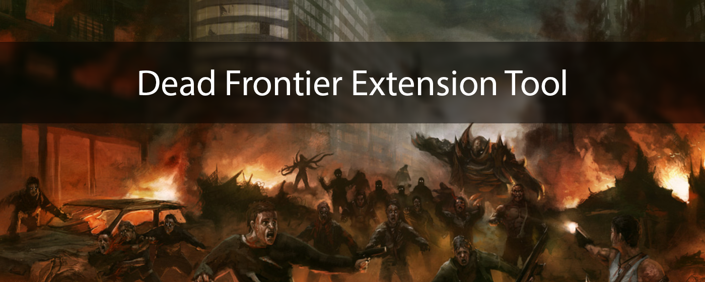

# About the project
This is a Chrome Extension Tool free of use that helps and enhances the user experience when inside an Outpost. The extension can be found and installed [here](https://chrome.google.com/webstore/detail/dead-frontier-scrap-helpe/gamejgjakdiakbfkgbldpnifkmjpaflh?hl=en). This extension does not collect any kind of data; to be more specific, it only adds more elements to the UI, and it's intended to not pass that limitation. If you have any doubts you can contact me on our clan discord (you can find the server invite on DF's forum [here](https://fairview.deadfrontier.com/onlinezombiemmo/index.php?topic=947166.0)).

# Features ?
- Item scrap worth:
    - For each item in your inventory slot which isn't locked, the script will look for its scrap value from the game's oficial wiki, adding that info for you.
    - For now only weapons, armor and implants are accounted. 
- Inventory total scrap value:
    - For each item in inventory which has scrap value checked, will be calculated the sum of all items, adding that info for you.
- More to come!

# Features to come
- [ ] Item-per-item trade page: get scrap value info for each item, as well total scrap value
- [ ] Help quantify bullets non-full stack price! (Tired of having to calculate how much those rounds are worth?)

# Support and how to contribute
This project is totally open-source - you can clone, fork, modify and then send a PR so that together we can build a better tool, helping our community even more.
All bugs and features ideas can be reported directly into the discord server or in-game messages.

    
    <h3>Praetorian Guard - Fairness and Respect</h3>

